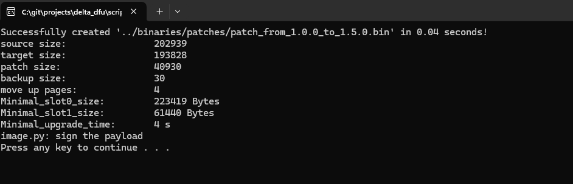

.. _Test Results:

Test Results
####################

The tests performed in previous chapter acknowledged that the aims of
the report had been fulfilled, it is possible to perform delta updates
on resource constrained embedded systems and that these updates cause a
meaningful reduction of data transmitted during a firmware upgrade. All
the test results can be found in below tables.

``nRF9160 DK``

============== ================= ================= ==========
chip           source image size target image size patch size
============== ================= ================= ==========
**nRF9160**    214KB             270KB             95KB
**nRF9160**    268KB             270KB             21KB
**nRF9160**    141KB             129KB             11KB
**nRF9160**    111KB             149KB             57KB
**nRF9160**    137KB             149KB             29KB
**nRF9160**    147KB             149KB             23KB
**nRF9160**    145KB             149KB             13KB
============== ================= ================= ==========

``nRF52840DK``

============== ================= ================= ==========
chip           source image size target image size patch size
============== ================= ================= ==========                                                 
**nRF52840**   239KB             293KB             109KB
**nRF52840**   288KB             293KB             24KB
**nRF52840**   265KB             293KB             70KB
============== ================= ================= ==========

--------------------------------

.. -The-size-of-the-patch-file-depends-on-two-factors:

The size of the patch file depends on two factors:
======================================================

.. note::

   *  the size of the source file

   *  the difference between the source and target files

.. -How-much-flash-space-need-to-be-reserved

How much flash space need to be reserved
=============================================

-  Primary slot: The primary slot will move up old image to reserve space for new image during patch applying, so it should reserve the move_up_pages and new image space.

.. important::
   * new image + (move_up_pages + 1) \* 4KB

   * move_up_pages = ((patch_size/2)/PAGE_SIZE > 0) ? ((patch_size/2)/PAGE_SIZE) : 1)

-  Secondary slot: The secondary slot is used to save the patch file and backup image, it also save the status information during patch applying for resume the operation when power is restored from the resume      the operation when power is restored power off. backup size depends on the difference between the source and target files and it will be printed after the first applying, so you need to check the log if you can not sure if the reserve space is enough.  

.. important::  
   * patch image + status_storage(16KB) + backup + 4KB

-  Now when you click the patch_xx.exe file to generate the patch file, you can get the information about the flash space, time consumption, etc. required to complete the upgrade.

|image5|
	
---------------------------------------------------------

.. -Suggestions

Suggestions
=========================================

.. tip::
   -  It is best to reserve 100KB for delta dfu in the secondary slot.

   -  If there is indeed a large patch file upgrade, please upgrade multiple times with a smaller patch size.  

