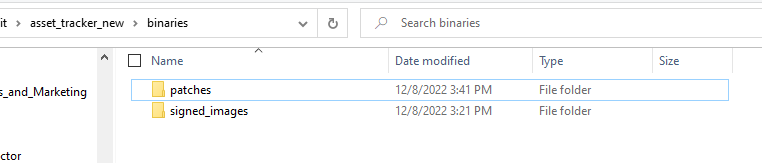
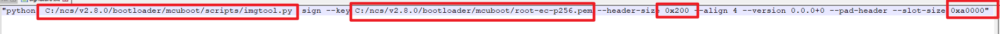
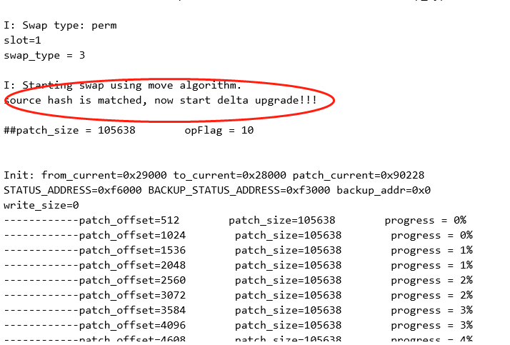
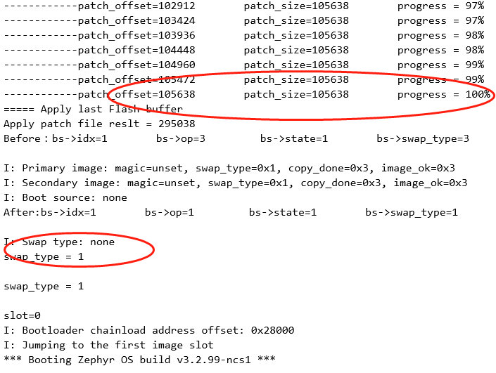

.. _testing:

Testing
########################

   This is a user guider to tell you how to test the delta dfu , it is
   really ease for you to merge it to your SDK.

   A delta firmware upgrade consists of the following steps:

   -  install essential tools

   -  pull the new boot code to replace your old code

   -  prepare test application

   -  generate patch file and transfer it to the secondary slot

   -  Restart MCU to perform the update

   -  Checking the result of the delta update

--------------

.. -install-essential-tools:

Install essential tools
=======================

#. | you should install detools on your PC: 

   |  enter "**pip install detools**" command in the python environment.

#. | you should install cryptography,intelhex,click,cbor: 

   |  enter "**pip install -r requirements.txt**" command in the python environment.

------------------------

.. -pull-the-new-boot-code-to-replace-your-old-code:

Pull the new boot code to replace your old code 
=================================================

you should pull the new boot code from below url and replace the boot
folder in your SDK directory (v2.x.x/bootloader/mcubboot/boot).

   https://github.com/Noy0908/delta_dfu_lib.git

   *  branch **delta-dfu-boot-v2.8.0** is the boot for nRF Connect SDK v2.8.0
   
   *  branch **delta-dfu-boot-v2.6.0** is the boot for nRF Connect SDK v2.6.0

   *  branch **delta-dfu-boot-v2.5.0** is the boot for nRF Connect SDK v2.5.0

   *  branch **delta-dfu-boot-v2.1.0** is the boot for nRF Connect SDK v2.1.0

--------------

.. -prepare-sample:

Prepare sample
===========================

1. | you can test it on our demoes, this demo has been tested on nRF9160DK, nRF52840DK and nRF54L15, below is the url and branches.

     https://github.com/Noy0908/delta_dfu.git

     *  branch **delta-dfu-sample-sysbuild** is the demo for NCS2.8.0.
     *  branch **delta-dfu-sample** is the demo for NCS2.5.0 and  NCS2.6.0.

2. | Of course you can test it on any application samples, but you need to add the following folders or files like the way shown in our demos to your project root directory.

     * ``scripts`` folder contains tools for generating patch files.
     * ``binaries/signed_images`` folder is used to save source image and target image.
     * ``binaries/patches`` folder is used to save patch image.
     * ``pm_static.yml`` file is used to reallocate your flash partition.
     * ``child_image/mcuboot.conf`` file is used to config delta dfu feature in mcuboot if your SDK version is lower than 2.7.0.
     * ``sysbuild/mcuboot`` folder is used to config delta dfu feature in mcuboot if your SDK version is higher than 2.7.0.

     |image1|

   |
3. | Regarding folder ``scripts``, you need to change the file: scripts/signature.py. 
     Make sure it aligns with your own bootloader/mcuboot absolute path.
     And make ``--slot-size 0xaf000`` equal to the primary slot size, make ``--header-size 0x800`` 
     equal to the mcuboot pad size.

4. | allocate your flash partition. you can create a ``pm_static.yml`` file in
     your project root directory to redefine the flash partition.

 .. note::
    remember that you must define the primary slot and secondary
    slot, and these two slots support differnet size.

5. | enable delta dfu. you can modify ``child_image/mcuboot.conf`` file to
     set these macros for different chipsets if your SDK version is lower than 2.7.0, 
	 or modify ``sysbuild.conf`` file if your SDK version is higher than 2.7.0:

   .. code-block:: python
      :caption: child_image/mcuboot.conf.
      :linenos:
      :emphasize-lines: 3,5

      #These macros for nRF54L15 sample
      CONFIG_BOOT_MAX_IMG_SECTORS=256
      CONFIG_NRF_RRAM_WRITE_BUFFER_SIZE=16
      #These macros for 9160DK and nRF52840 sample
      CONFIG_BOOT_MAX_IMG_SECTORS=240
      CONFIG_SOC_FLASH_NRF_EMULATE_ONE_BYTE_WRITE_ACCESS=y
      # support application delta dfu
      CONFIG_BOOT_UPGRADE_APP_DELTA=y
      CONFIG_MAIN_STACK_SIZE=20480
	  
   .. code-block:: python
      :caption: sysbuild.conf.
      :linenos:
      :emphasize-lines: 1,2

      SB_CONFIG_BOOTLOADER_MCUBOOT=y
      SB_CONFIG_BOOT_SIGNATURE_TYPE_ECDSA_P256=y
      SB_CONFIG_PM_OVERRIDE_EXTERNAL_DRIVER_CHECK=n
      SB_CONFIG_PM_EXTERNAL_FLASH_MCUBOOT_SECONDARY=n

6. | enable mcuboot in your project config files(prj.conf).

   .. code-block:: python
      :caption: application configurations.
      :linenos:
      :emphasize-lines: 1,3

      CONFIG_BOOTLOADER_MCUBOOT=y
      CONFIG_IMG_MANAGER=y
      CONFIG_MCUBOOT_IMG_MANAGER=y

----------------------------

.. -generate-patch-file-and-transfer-it-to-the-secondary-slot:

Generate patch file and transfer it to the secondary slot
=========================================================

#. | Edit scripts/signature.py file. replace the imgtool.py path and
     root-ec-p256.pem path in the file with your own path, and modify the
     primary slot size to your own define.

     |image2|

   |
#. | Generate the patch file. The patch file is generated by comparing the
     difference between the source image and the target image.

   -  Get the source file, the source image is a binary file which converted from the hex file that compiled from the source project.
      we can directly use the J-Flash tool to convert hex file to binary file by saving it to a binary file named "source_xxx.bin"; 
      then copy the source image to ``binaries/signed_images`` folder.	

    .. note::	
         * If your SDK version is lower than 2.7.0, the source image is converted from the ``app_signed.hex`` file.
         * If your SDK version is higher than 2.7.0, the source image is converted from the ``zephyr.signed.hex`` file.

   -  Get the target file, modify the source project and compile again, rename the upgrade image to ``target_xxx.bin``, then copy it to ``binaries/signed_images`` folder.

    .. note::
	 * ``app_update.bin`` is your upgrade image if your SDK version is lower than 2.7.0
	 * ``zephyr.signed.bin`` is your upgrade image if your SDK version is higher than 2.7.0

   -  Double click ``scripts/patch_***.exe`` to execute patch command, execute ``scripts/patch_52_91.exe`` if your chip is nRF52840 or nRF9160,
      and ``scripts/patch_54l15.exe`` if your chip is nRF54L15. then the differential file will be automatically generated in the directory ``binaries/patches``.    Please use the differential file ``signed_patch.bin`` as patch file.

    .. note::
	If your device has been upgraded with delta dfu once, when upgrading again, you only need to rename the target_xxx.bin file of the last upgrade to source_xxx.bin, then copy the new target_xxx.bin file to the specified folder to regenerate the patch file. 

#. | Transmit the patch image to secondary slot. Now we supports multiple
     OTA methods, such as **4G/WiFi/Bluetooth/NFC**, etc. It can also be
     delivered through wired methods, such as **UART, USB or SPI bus**.

-----------------------

.. -restart-mcu-to-perform-the-update:

Restart MCU to perform the update
==================================

After the patch image is saved to flash, you should call the function
``(boot_request_upgrade(BOOT_UPGRADE_PERMANENT)`` in the application and then restart MCU.
After the MCU restarts, it will check whether the differential image in
the flash area is valid, verify the signature and hash data.
Differential upgrading will only be performed when all these information
are matched. While applying patch.bin, the old image (source. bin) and
patch image combines to generate a new image and save it in the flash
primary slot area, then MCU jump to the application entry.

|image3|

--------------------------

.. -checking-the-result-of-the-update:

Checking the result of the update
==================================

you can check the output log to see if the upgrade is successful and the
MCU run the target image.

|image4|

